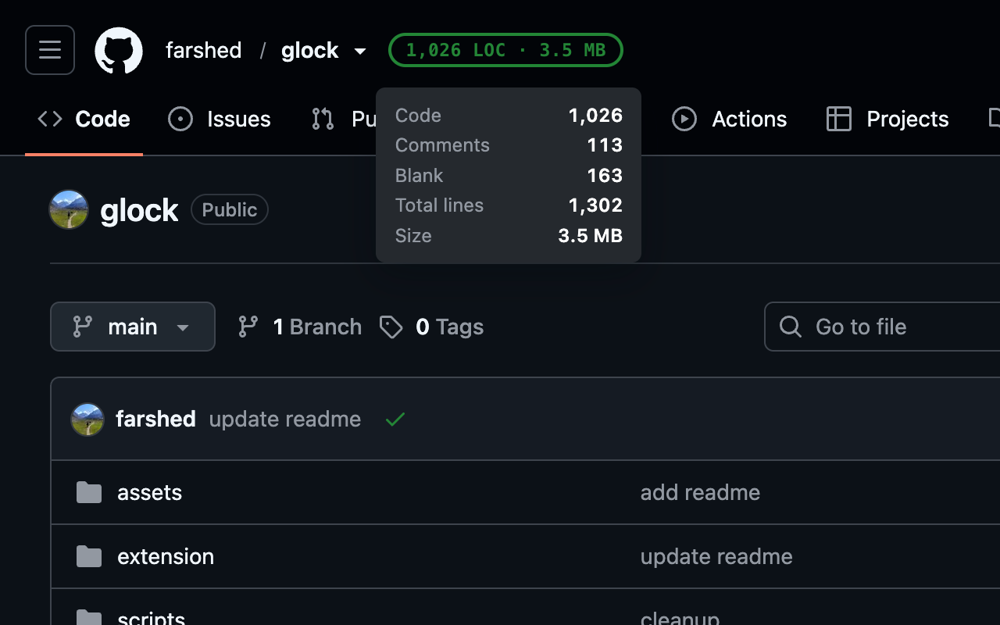

<div align="center">
  
  <h1>Glock</h1>
  <p>GitHub Lines-Of-Code Kounter.</p>
  <p><a href="https://chromewebstore.google.com/detail/glfjdpepjbakhenjcgmnmcebpfhkpmch"><strong>Install for Chrome</strong></a></p>
</div>

---

Glock is a chrome extension that displays LOC on GitHub repos. It uses [tokei](https://github.com/XAMPPRocky/tokei) for counting.

Counting runs entirely in the browser: the extension downloads the repository archive from GitHub and counts it with tokei compiled to WebAssembly.

<div align="center">
  
</div>

## Building

```
rustup target add wasm32-unknown-unknown   # once
./scripts/build-wasm.sh
```

## Caching

Counts are cached in the browser for 15 minutes, so the badge may not reflect
new commits right away. Repositories above the configured size limit (50 MB by
default) show no badge, since counting means downloading the whole archive.
